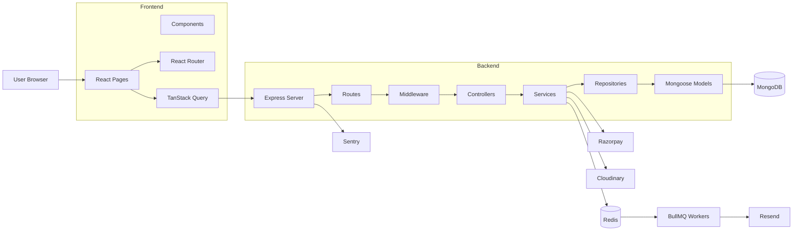
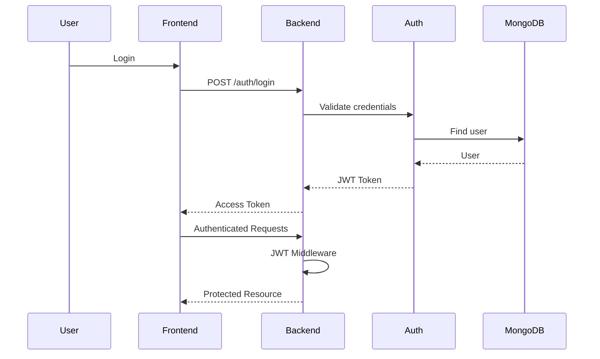
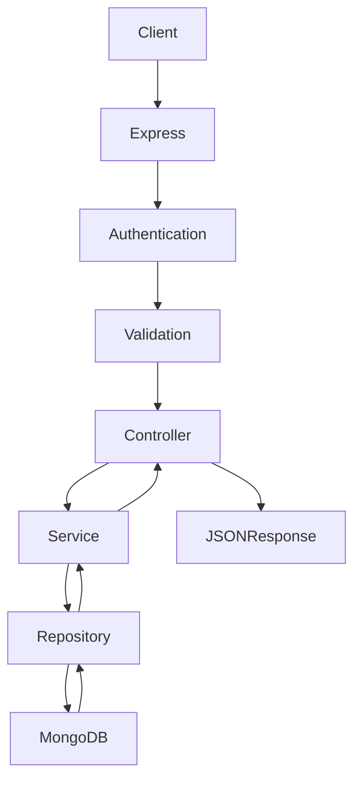
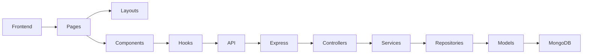
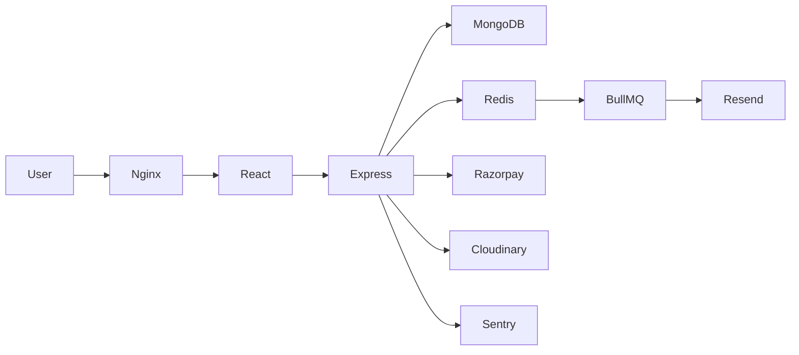
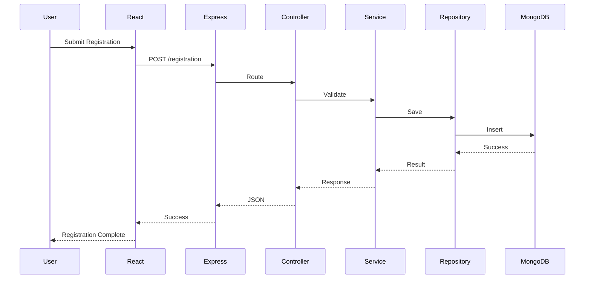

# Architecture Documentation

## Architecture Overview

MUN Gridixia follows a layered full-stack architecture consisting of a
React frontend, an Express.js backend, MongoDB for persistence,
Redis/BullMQ for background processing, and several external
integrations including Razorpay, Cloudinary, Resend, and Sentry.

---

# Technology Stack

Layer Technology

---

Frontend React, TypeScript, Vite, Tailwind CSS
Backend Node.js, Express.js, TypeScript
Database MongoDB + Mongoose
Queue BullMQ + Redis
Authentication JWT
Payments Razorpay
Storage Cloudinary
Email Resend
Monitoring Sentry

---

# Backend Architecture

    backend/src/
    ├── app.ts
    ├── server.ts
    ├── config/
    ├── controllers/
    ├── features/
    ├── middleware/
    ├── repositories/
    ├── routes/
    ├── services/
    ├── workers/
    ├── queues/
    ├── models/
    └── validators/

---

# System Architecture

---

# Authentication Flow

---

# Request Flow

---

# Component Diagram

---

# Deployment Diagram

---

# Sequence Diagram

---

# Architectural Layers

1.  Presentation Layer (React UI)
2.  Routing Layer (React Router & Express Routes)
3.  Middleware Layer (Authentication, Validation, Error Handling)
4.  Controller Layer (HTTP request processing)
5.  Service Layer (Business Logic)
6.  Repository Layer (Database access)
7.  Persistence Layer (MongoDB Models)
8.  Background Processing Layer (BullMQ Workers)
9.  External Integration Layer (Razorpay, Cloudinary, Resend, Sentry)

---

# Project Request Lifecycle

    Browser
       │
       ▼
    React UI
       │
       ▼
    TanStack Query
       │
       ▼
    Express Route
       │
       ▼
    Middleware
       │
       ▼
    Controller
       │
       ▼
    Service
       │
       ▼
    Repository
       │
       ▼
    MongoDB

    Async Tasks
       │
       ▼
    Redis Queue
       │
       ▼
    BullMQ Workers
