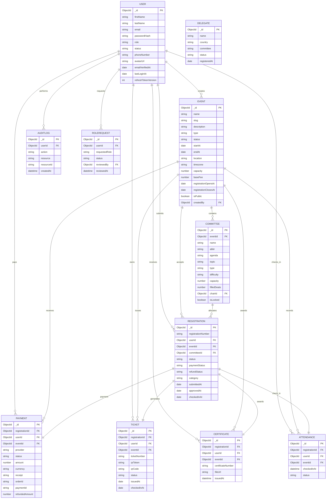

# Database Documentation

## Database Overview

MUN Gridixia uses **MongoDB** with **Mongoose** as the ODM. Common
schema behavior is centralized in `backend/src/models/shared.ts`,
providing timestamps, soft deletion, JSON transformation, and shared
schema options.

---

# Collections

Collection Model Purpose

---

users User User accounts
events Event MUN events
committees Committee Committees for events
delegates Delegate Delegate records
registrations Registration Event registrations
payments Payment Payment records
tickets Ticket Event tickets
attendance Attendance Check-in records
certificates Certificate Certificates
auditlogs AuditLog Audit history
rolerequests RoleRequest Role elevation requests

---

# Relationships

## User

Referenced by:

- Event.createdBy
- Registration.userId
- Payment.userId
- Ticket.userId
- Attendance.userId
- Certificate.userId
- AuditLog.userId
- RoleRequest.userId
- RoleRequest.reviewedBy

## Event

Referenced by:

- Committee.eventId
- Registration.eventId
- Payment.eventId
- Ticket.eventId
- Attendance.eventId

## Committee

Referenced by:

- Registration.committeeId

## Registration

Referenced by:

- Payment.registrationId
- Ticket.registrationId
- Attendance.registrationId
- Certificate.registrationId

---

# Model Summary

## User

**Collection:** `users`

### Important Fields

- firstName
- lastName
- email
- passwordHash
- role
- status
- phoneNumber
- avatarUrl
- refreshTokenVersion

### Validation

- Email validation
- Role enum
- Status enum

### Indexes

- Unique email
- Role + status
- Status + createdAt

---

## Event

**Collection:** `events`

### Relationship

- `createdBy → User`

### Validation

- Unique slug
- Registration window validation
- Event date validation

### Indexes

- Unique slug
- Status
- Start date
- CreatedBy

---

## Committee

### Relationships

- `eventId → Event`
- `chairId → User`

### Indexes

- Event
- Chair
- Soft delete lookup

---

## Registration

### Relationships

- `userId → User`
- `eventId → Event`
- `committeeId → Committee`

### Registration Workflow

```text
Draft
 ↓
Pending
 ↓
Approved
 ↓
Confirmed
 ↓
Checked In
```

---

## Payment

### Relationships

- `registrationId → Registration`
- `userId → User`
- `eventId → Event`

### Provider Types

- Razorpay
- Cash
- Bank Transfer
- Manual

### Status

- Created
- Pending
- Authorized
- Captured
- Failed
- Refunded

---

## Ticket

### Relationships

- `registrationId → Registration`
- `userId → User`
- `eventId → Event`

### Unique Fields

- ticketNumber
- qrToken

---

## Delegate

### Collection

`delegates`

### Status Values

- pending
- confirmed
- waitlisted

---

## Attendance

Tracks delegate check-in history.

Relationships:

- registrationId
- eventId
- userId

---

## Certificate

Stores generated certificates.

Relationships:

- registrationId
- userId
- eventId

---

## AuditLog

Stores administrative audit history.

Relationship:

- userId → User

---

## RoleRequest

Relationships:

- userId → User
- reviewedBy → User

---

# Common Schema Features

All models inherit common functionality from:

```text
backend/src/models/shared.ts
```

Including:

- createdAt
- updatedAt
- soft deletion
- JSON serialization
- common indexes

---

## Mermaid ER Diagram


